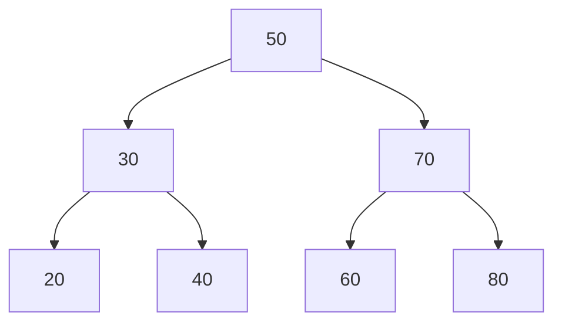

### Introducción a las Estructuras de Datos

Las estructuras de datos son un componente fundamental en la computación, representando una forma organizada y eficiente de almacenar, gestionar y manipular información. Desde listas simples hasta estructuras complejas como árboles y grafos, estas herramientas permiten a los desarrolladores resolver problemas de manera efectiva y optimizar el rendimiento de los programas.

#### ¿Qué son las estructuras de datos?

En términos simples, una estructura de datos es una manera de organizar datos para que puedan ser accedidos y utilizados eficientemente. Existen estructuras de datos básicas como arreglos, listas enlazadas, pilas y colas, y otras más avanzadas como árboles, tablas hash y grafos. Cada una está diseñada para aplicaciones específicas y se elige según el tipo de problema que se desea resolver.

#### Clasificación de las estructuras de datos

1. **Lineales:** Los elementos se almacenan en una secuencia ordenada. Ejemplos:
   - **Arrays:** Colecciones de elementos contiguos en memoria.
   - **Listas enlazadas:** Elementos conectados mediante punteros.
   - **Pilas y colas:** Estructuras con reglas específicas para la inserción y eliminación de datos.

2. **No lineales:** No siguen un orden secuencial. Ejemplos:
   - **Árboles:** Estructuras jerárquicas con nodos conectados.
   - **Grafos:** Redes de nodos y aristas que representan relaciones complejas.

#### Ventajas de las estructuras de datos

- **Eficiencia:** Permiten realizar operaciones como búsqueda, inserción y eliminación de manera rápida y eficiente.
- **Flexibilidad:** Algunas estructuras pueden adaptarse dinámicamente al tamaño de los datos.
- **Reutilización:** Los algoritmos diseñados para estructuras específicas pueden ser reutilizados en diferentes aplicaciones.

#### Desventajas de las estructuras de datos

- **Complejidad:** Algunas estructuras como los árboles balanceados o grafos pueden ser difíciles de implementar.
- **Sobrecarga:** Requieren más memoria o procesamiento si no se seleccionan adecuadamente para el problema.

#### Uso práctico y aplicaciones

1. **Ordenación y búsqueda:** Algoritmos como la búsqueda binaria y el ordenamiento rápido dependen de estructuras como arrays y árboles.
2. **Gestor de tareas:** Pilas y colas son esenciales para manejar procesos en sistemas operativos.
3. **Redes sociales:** Grafos representan relaciones entre usuarios.

#### Ejemplo visual: Árbol Binario de Búsqueda (BST)

Un árbol binario de búsqueda organiza los datos de manera que cada nodo contiene un valor mayor que sus descendientes izquierdos y menor que sus descendientes derechos. Esto permite búsquedas eficientes con una complejidad promedio de O(log n).

#### Recursos adicionales

- [Documentación oficial de Python](https://docs.python.org/3/tutorial/datastructures.html)
- [Curso interactivo sobre estructuras de datos](https://www.geeksforgeeks.org/data-structures/)

#### ¡Descarga imágenes y recursos gratuitos!

Para complementar el aprendizaje, explora las imágenes y diagramas disponibles en plataformas como [Unsplash](https://unsplash.com/) o [Pexels](https://www.pexels.com/).

Con estas bases, el mundo de las estructuras de datos está listo para ser explorado. ¡Empieza a experimentar y dominar estas herramientas esenciales en la programación!

